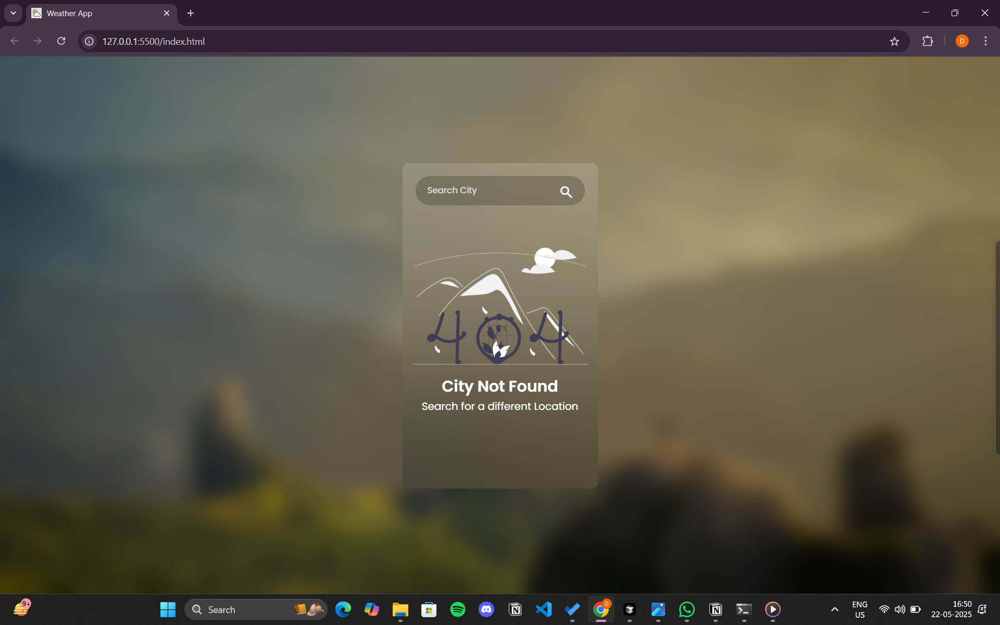

# 🌦️ Weather App

A responsive and easy-to-use weather app built with HTML, CSS, and JavaScript. It fetches real-time weather data using the OpenWeatherMap API.

---

## 🎥 Demo Video

[https://github.com/DineshPabboju/Weather-App/blob/main/Preview/videoDemo.mp4]


## 📸 Screenshots

### 🌍 Home Page
  


## 🚀 Features

- 🔍 Search for any city
- 📡 Fetches real-time data from OpenWeatherMap API
- 🌡️ Shows temperature, weather condition, humidity, and wind speed
- 📱 Fully responsive design
- 🎨 Simple, clean UI with smooth user experience

---

## 🛠️ Technologies Used

- HTML5
- CSS3
- JavaScript 
- OpenWeatherMap API

---

## 🧑‍💻 How to Run Locally

```bash
git clone https://github.com/DineshPabboju/Weather-App.git
cd Weather-App


🔑 Setup OpenWeatherMap API Key
Visit OpenWeatherMap and sign up for a free API key.

## Replace the placeholder in script.js:

const apiKey = "YOUR_API_KEY"; // Replace with your actual API key

📄 License
This project is licensed under the MIT License.

